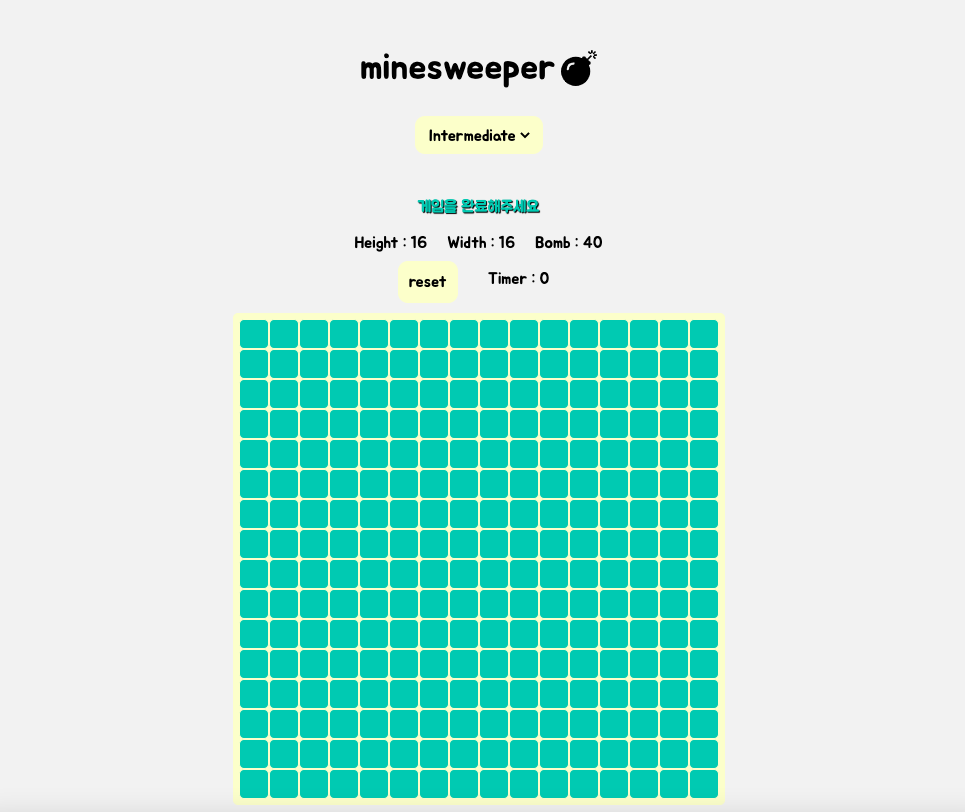
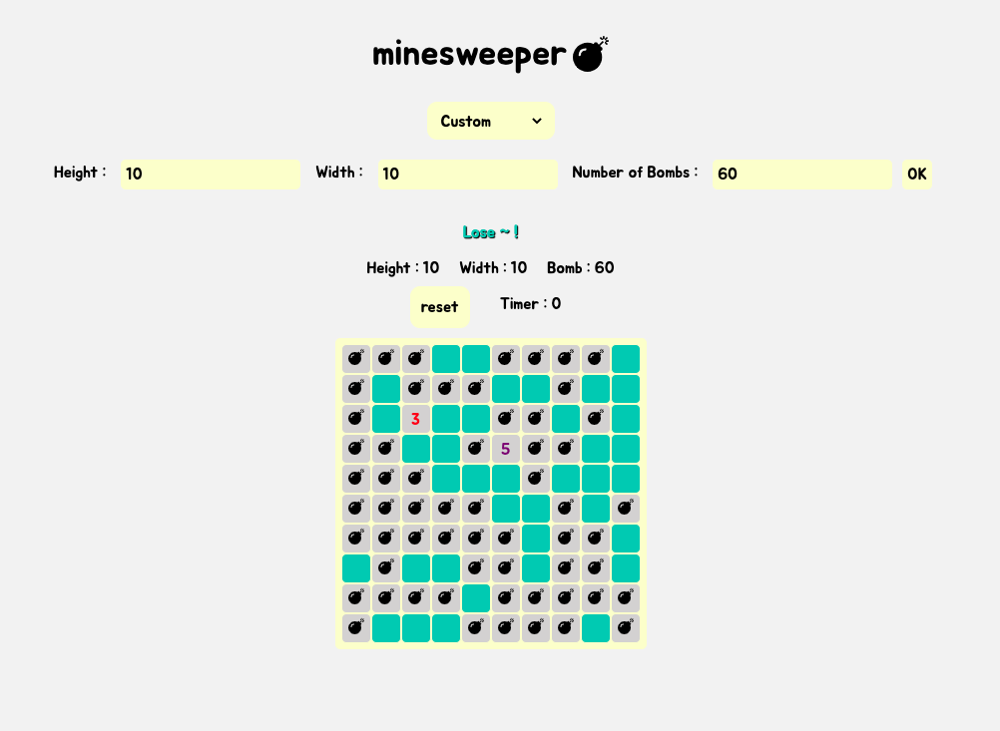

# 지뢰찾기 게임 (minesweeper)

## 배포 링크
https://minesweeper-minyukyung.vercel.app
<br/>
<br/>

## 기술 스택
- React 18 + TypeScript
- React Router
- Redux (redux-toolkit)
- CSS Framwork: styled-components
<br/>

## About project
1. 지뢰찾기 게임 만들기

2. 기능 구현
    - 첫 클릭시 지뢰가 터지지않게 구현 : 첫 클릭과 게임 셋팅을 redux-toolkit 으로 관리하여, 첫 클릭시 dispatch 로 게임을 셋팅하도록 설정
    - 오른쪽 클릭 깃발 기능 : onContextMenu 로 우클릭 이벤트를 설정하고, redux-toolkit 으로 깃발 유무 상태를 관리
    - Custom 게임 설정 : custom form 으로 상세 설정을 하면, dispatch 로 해당 내용을 보내 보드를 교체
    - 타이머 : useEffect 로 타이머 시작과 종료를 관리하고, redux-toolkit 으로 타이머 시간을 관리

3. 서비스 화면 미리보기
    - 메인 페이지
    

    - 게임 진행 중
    
    
    - 커스텀 게임 설정
    
<br/>

## 실행 방법
1. repository clone
```
$ git clone https://github.com/MINYUKYUNG/redux-toolkit-project-m.git
```
2. dependencies install
```
npm install
```
3. project start
```
npm run start
```
<br/>

## 폴더 구조
| 폴더 | 구분 |
| -- | -- |
| assets | font, images, json 등 로컬 파일 폴더 |
| components | 공통 컴포넌트 파일 폴더 |
| pages | url 주소 페이지 파일 폴더 |
| routes | 리액트 라우팅 파일 폴더 |
| store | 전역상태관리 파일 폴더 |
| styles | 전역적으로 사용하는 style 파일 폴더 |
| utils | 중복 로직 함수를 순수 함수화한 파일 폴더 |
<br/>
